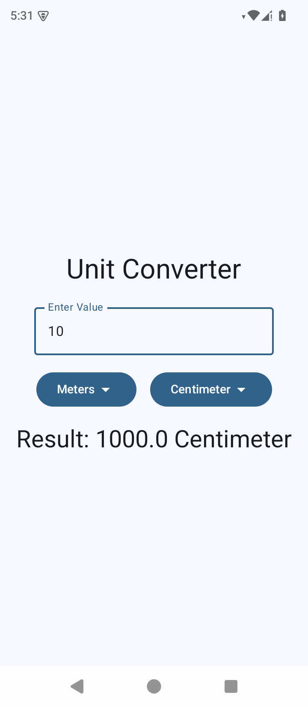

# Unit Converter App

## Description

This is a simple Android unit converter app built using **Kotlin** and **Jetpack Compose**. It allows users to convert length units such as meters, centimeters, feet, and millimeters. The app features a text input field for entering the value (defaults to meters) and two dropdown menus: one to select the "from" unit and another for the "to" unit. The conversion happens automatically upon selection or input change.

## Features

- **Intuitive UI**: Clean Jetpack Compose interface with Material Design components.
- **Real-time Conversion**: Updates the result instantly as the user types or changes units.
- **Supported Units**: Meters (m), Centimeters (cm), Feet (ft), Millimeters (mm).
- **Default Settings**: Input starts with meters as the base unit.
- **Responsive Design**: Adapts to different screen sizes.

## Screenshots

For a visual overview, check the screenshot above or explore the app in the emulator/device.

## Installation

1. Clone or download this repository.
2. Open the project in **Android Studio**.
3. Ensure you have the latest **Android SDK** and **Jetpack Compose** dependencies.
4. Build and run the app on an Android device or emulator .

## How to Use

1. Enter a numeric value in the text input field.
2. Select the "From" unit from the first dropdown.
3. Select the "To" unit from the second dropdown.
4. The converted value appears below the input.

## Tech Stack

- **Language**: Kotlin
- **UI Framework**: Jetpack Compose
- **Build Tool**: Gradle
- **Target SDK**: Android 14 (API 34)